# Similarity Uniform Fuzzy Hash

Similarity Uniform Fuzzy Hash is a tool that allows to accurately and efficiently compute the similarity between two files (or sets of bytes) as a 0 to 1 score.

For that purpose, it first computes for each file a Context Triggered Piecewise Hash (CTPH), also known as fuzzy hash, and then compares the hashes.

Both, the hash computation and the hashes comparison algorithms present linear complexity, the former with respect to the file size (or the amount of bytes), and the latter with respect to the hashes length, which is proportional to the files size divided by a choosable factor. This fact makes the tool very efficient and ideal for clustering (finding the most or least similar files to a given one between a set or database of many files). In fact, there is no need to store the files, storing the hashes is enough.

The tool provides methods to:

  * Compute a file hash.

  * Compute the hashes of a set of files.

  * Compute the similarity between two hashes.

  * Compute and show in a table the similarity between a hash and a set of hashes, ordering them by similarity to the first one.

  * Compute and show in a table the similarity between all the hashes in a set.

  * Save and load hashes into / from a text file.

  * Visually compare two files or hashes, identifying their common parts.

The tool is a Java JAR and can be used in two ways:

  * By means of the command line interface.

  * As a library or dependency that can be imported into a Java project.

The latest release is available here:

https://github.com/s3curitybug/similarity-uniform-fuzzy-hash/releases/latest

Readme contents:

  * [The Algorithm](#The Algorithm)
  * [The Command Line Interface](#The Command Line Interface)
  * [The Java Library](#The Java Library)

# The Algorithm

The hash computation algorithm divides the file in blocks. The location of the divisions depends on the file contents. Thus, the blocks size is not constant, but the mean block size is chosen by the user through a parameter called "factor". So the file is divided in blocks of size around factor. Then, each block is converted into two hexadecimal numbers, the first one representing its content and the second one representing its size. Finally, the hash is written as the factor followed by each block.

<p align="center">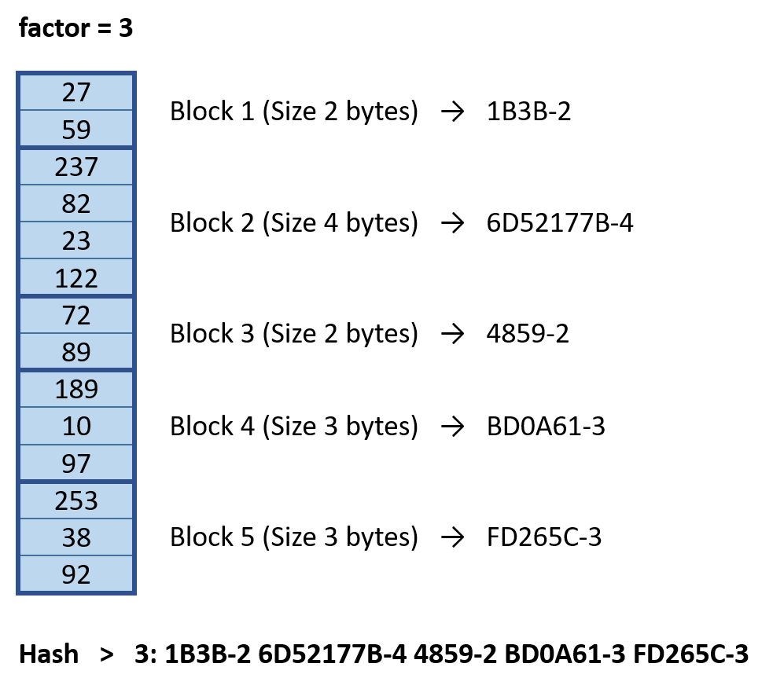</p>

This way, two files sharing some content would produce two hashes that share some blocks. The comparison algorithm finds the blocks of the first hash which are present in the second one (independently on their position), and returns a 0 to 1 similarity score based on the sum of their size, divided by the file total size, which is very accurate.

Note that the similarity score between File 1 and File 2 indicates the proportion of content of File 1 which is present in File 2. This is different to the similarity score between File 2 and File 1, which indicates the proportion of content of File 2 which is present in File 1. For files with similar size, both scores will be close. However, comparing a small file which is part of a big file to that big file would return a high score between the small file and the big one, but a low score between the big file and the small one. This means that the algorithm is able to detect small files inside big ones. For instance, it can detect images inside documents, and malwares inside executables. The tool also provides methods to compute the maximum, minimum, arithmetic mean and geometric mean between the two similarity scores of two files.

<p align="center">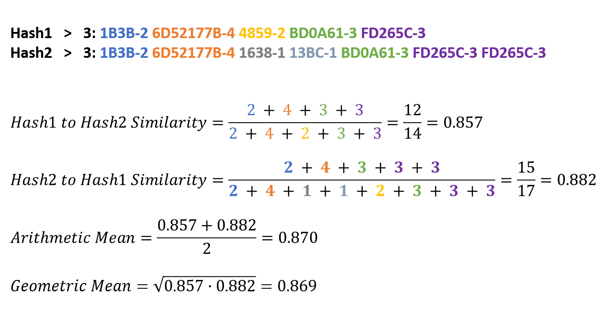</p>

Also note that the factor must be chosen carefully. The factor indicates the mean block size, in other words, the mean amount of bytes that must appear consecutively in both files such that some similarity is added to the score. This means that choosing too small factors would divide files in too small blocks, which may lead to similarities higher than expected and false positives in similarity detections, while choosing too big factors would divide files in too big blocks, which may cause similarities lower than expected and false negatives.

Additionally, the hash length (which depends on the amount of blocks) is proportional to the file size divided by the factor. This means that big files and small factors produce large hashes (high amount of blocks), while small files and big factors produce small hashes (low amount of blocks). Consequently, it is recommended using a big factor when comparing big files, and a small factor when comparing small ones. However, two hashes can only be compared if they were computed with the same factor. This means that, when comparing small files to big ones, a small factor must be used.

Due to the hash computation algorithm nature, factor must always be an odd number and larger than 2.

# The Command Line Interface

In order to use the command line interface, there is no need to download or compile the project, downloading the JAR is enough.

The JAR can be executed using the following command:

```shell
java -jar similarity-uniform-fuzzy-hash-{version}.jar
```

A Java JRE installation is required to run the JAR.

Running the JAR without any argument or with the `--help` or `-h` argument will display the usage:

<p align="center"></p>

Arguments:

  * `--computeFileHash` or `-cfh`

Computes the hash of one or several files (one per argument).

The argument `--factor` or `-f` must be introduced, indicating the factor that will be used for the hash or hashes computation (remember that it must be an odd number and larger than 2).

<p align="center">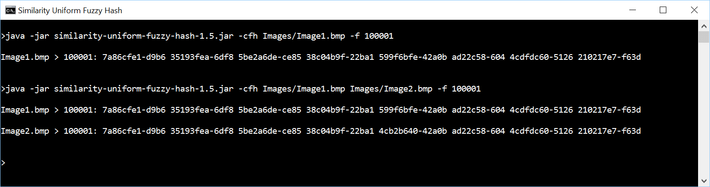</p>

  * `--computeDirectoryHashes` or `-cdh`

Computes the hashes of all the files inside one or several directories (one per argument).

The argument `--factor` or `-f` must be introduced, indicating the factor that will be used for the hash or hashes computation (remember that it must be an odd number and larger than 2).

The argument `--recursive` or `-r` can be introduced to indicate that directories inside directories must be traversed recursively.

<p align="center">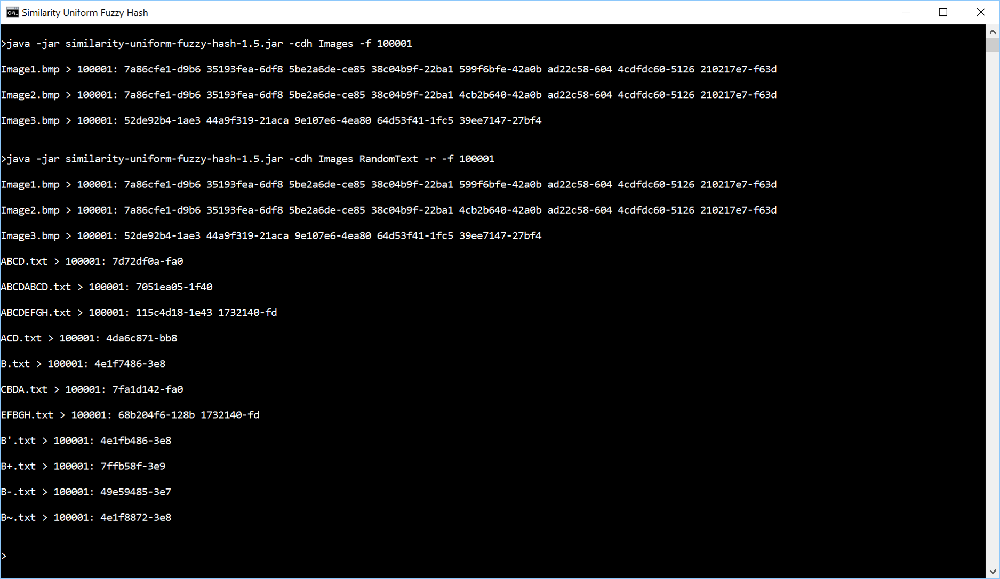</p>

  * `--saveToTextFile` or `-stf`

Saves all computed hashes into one or several text files (one per argument) in their hexadecimal representation. The hashes are appended to the end of the file.

The argument `--overwrite` or `-o` can be introduced to indicate that the file must be overwritten, instead of appending the hashes to its end.

<p align="center">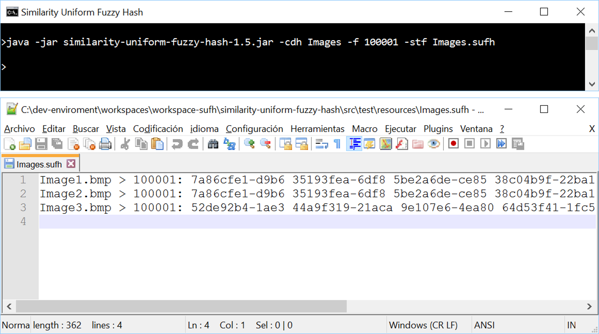</p>

  * `--saveToAsciiFile` or `-saf`

Saves all computed hashes into one or several text files (one per argument) in their ascii representation, which is less human readable than the hexadecimal representation, but occupies less disk space. The hashes are appended to the end of the file.

The argument `--overwrite` or `-o` can be introduced to indicate that the file must be overwritten, instead of appending the hashes to its end.

<p align="center">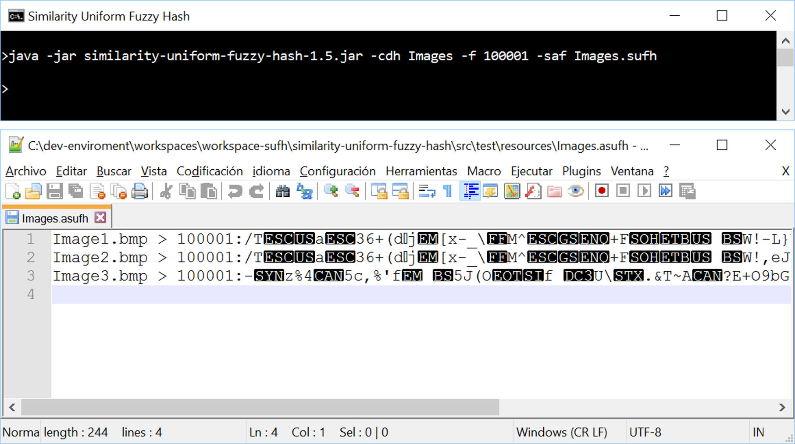</p>

  * `--loadFromTextFile` or `-ltf`

Loads all the hashes saved in one or several text files (one per argument). All hashes must be in their hexadecimal representation. Lines starting by # are ignored.

<p align="center">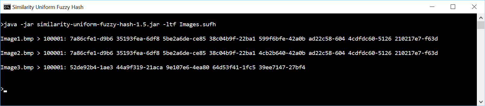</p>

  * `--loadFromAsciiFile` or `-laf`

Loads all the hashes saved in one or several text files (one per argument). All hashes must be in their ascii representation. Lines starting by # are ignored.

<p align="center">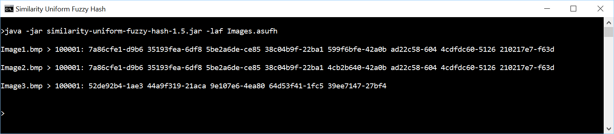</p>

  * `--exportToTextFile` or `-etf`

Exports all the hashes saved in a text file (first argument) in their ascii representation to another text file (second argument) saving them in their hexadecimal representation. The hashes are appended to the end of the file.

The argument `--overwrite` or `-o` can be introduced to indicate that the file must be overwritten, instead of appending the hashes to its end.

<p align="center">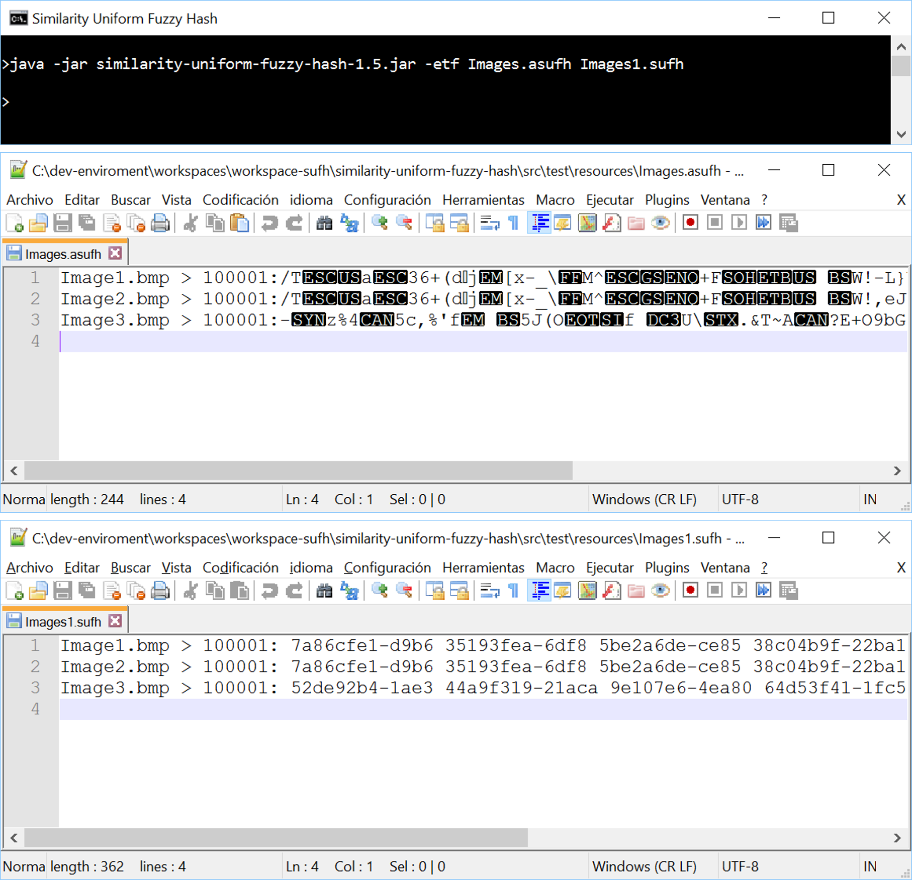</p>

  * `--exportToAsciiFile` or `-eaf`

Exports all the hashes saved in a text file (first argument) in their hexadecimal representation to another text file (second argument) saving them in their ascii representation. The hashes are appended to the end of the file.

The argument `--overwrite` or `-o` can be introduced to indicate that the file must be overwritten, instead of appending the hashes to its end.

<p align="center">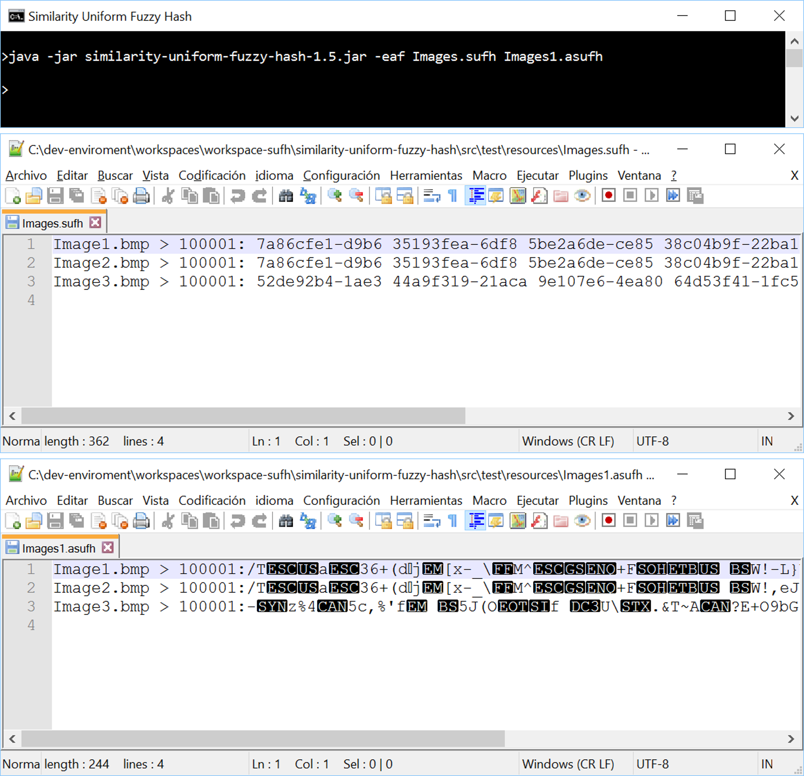</p>

  * `--compare` or `-x`

Compares two hashes.

-If no argument is introduced, and two hashes were computed with the argument `--computeFileHash` or `-cfh`, they are compared.

<p align="center">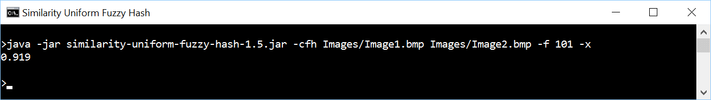</p>

-If one argument is introduced indicating a computed or loaded hash, and another hash was computed with the argument `--computeFileHash` or `-cfh`, the computed hash is compared to the indicated one.

<p align="center">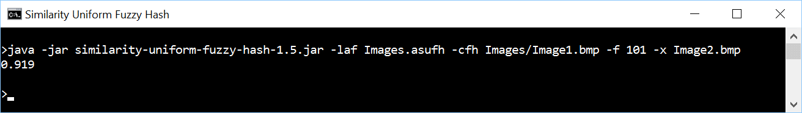</p>

-If two arguments are introduced indicating computed or loaded hashes, they are compared.

<p align="center">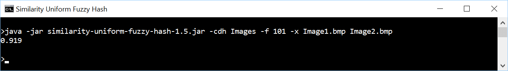</p>

  * `--compareToAll` or `-xya`

Compares in a table a hash to all computed and loaded hashes, showing in the table the direct similarity (hash to hashes), the reverse similarity (hashes to hash), the maximum and the minimum between both, and their arithmetic and geometric mean.

The argument `--sortingBy` or `-sort` can be introduced to sort the table by similarity. If no argument is introduced, the default sorting criterion will be by descending direct similarity. An argument can be introduced to specify a different criterion. Check the JAR `--help` or `-h` argument to see all the possible criteria.

The argument `--rowsLimit` or `-limit` can be introduced, indicating the maximum number of rows to display in the table.

The argument `--truncateNames` or `-trunc` can be introduced, indicating the maximum number of characters to display in the hashes names.

The argument `--markAbove` or `-ma` can be introduced, indicating an upper threshold (0 to 1) to mark all similarities above or equal to it with a color.

The argument `--markBelow` or `-mb` can be introduced, indicating a lower threshold (0 to 1) to mark all similarities below it with a color.

About the `--compareToAll` or `-xya` argument:

-If no argument is introduced, and a hash was computed with the argument `--computeFileHash` or `-cfh`, the computed hash is compared to all computed and loaded hashes.

<p align="center">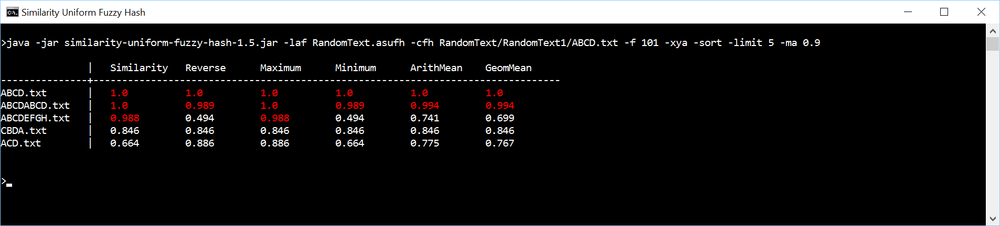</p>

-If one argument is introduced indicating a computed or loaded hash, it is compared to all computed and loaded hashes.

<p align="center">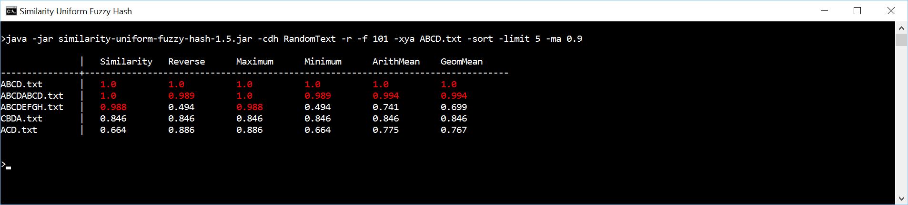</p>

-If multiple arguments are introduced indicating computed or loaded hashes, the first one is compared to all the indicated ones.

<p align="center">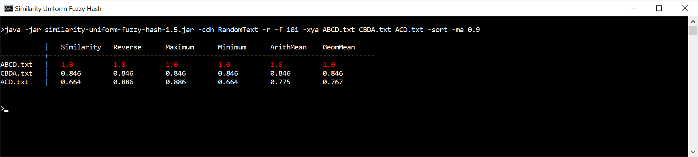</p>

  * `--compareAll` or `-xa`

Compares in a table all computed and loaded hashes, showing in the table for each hash its similarity to every other one.

The argument `--truncateNames` or `-trunc` can be introduced, indicating the maximum number of characters to display in the hashes names.

The argument `--markAbove` or `-ma` can be introduced, indicating an upper threshold (0 to 1) to mark all similarities above or equal to it with a color.

The argument `--markBelow` or `-mb` can be introduced, indicating a lower threshold (0 to 1) to mark all similarities below it with a color.

About the `--compareToAll` or `-xya` argument:

-If no argument is introduced, all computed and loaded hashes are compared.

<p align="center">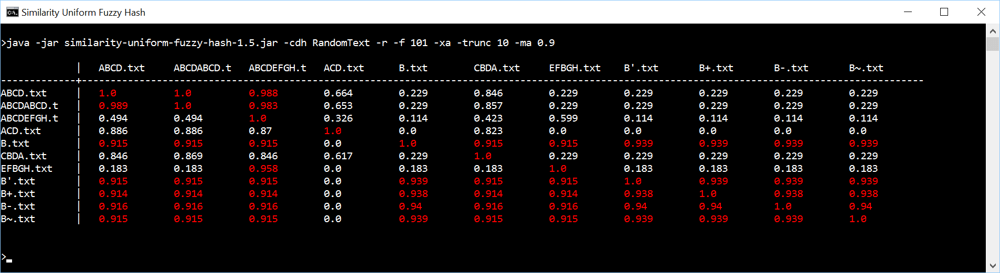</p>

-If multiple arguments are introduced indicating computed or loaded hashes, all the indicated ones are compared.

<p align="center">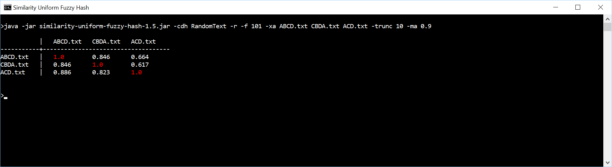</p>

  * `--representVisually` or `-rv`

Shows a visual representation of a hash. Each block is represented as one or several characters, depending on the block size.

The argument `--lineWrap` or `-wrap` can be introduced, indicating the length at which lines will be wrapped. At the begining of each line, a percentage will be displayed indicating the file size scroll.

About the `--representVisually` or `-rv` argument:

-If no argument is introduced, and a hash was computed with the argument `--computeFileHash` or `-cfh`, the computed hash is represented visually.

<p align="center"></p>

-If one argument is introduced indicating a computed or loaded hash, it is visually represented.

<p align="center">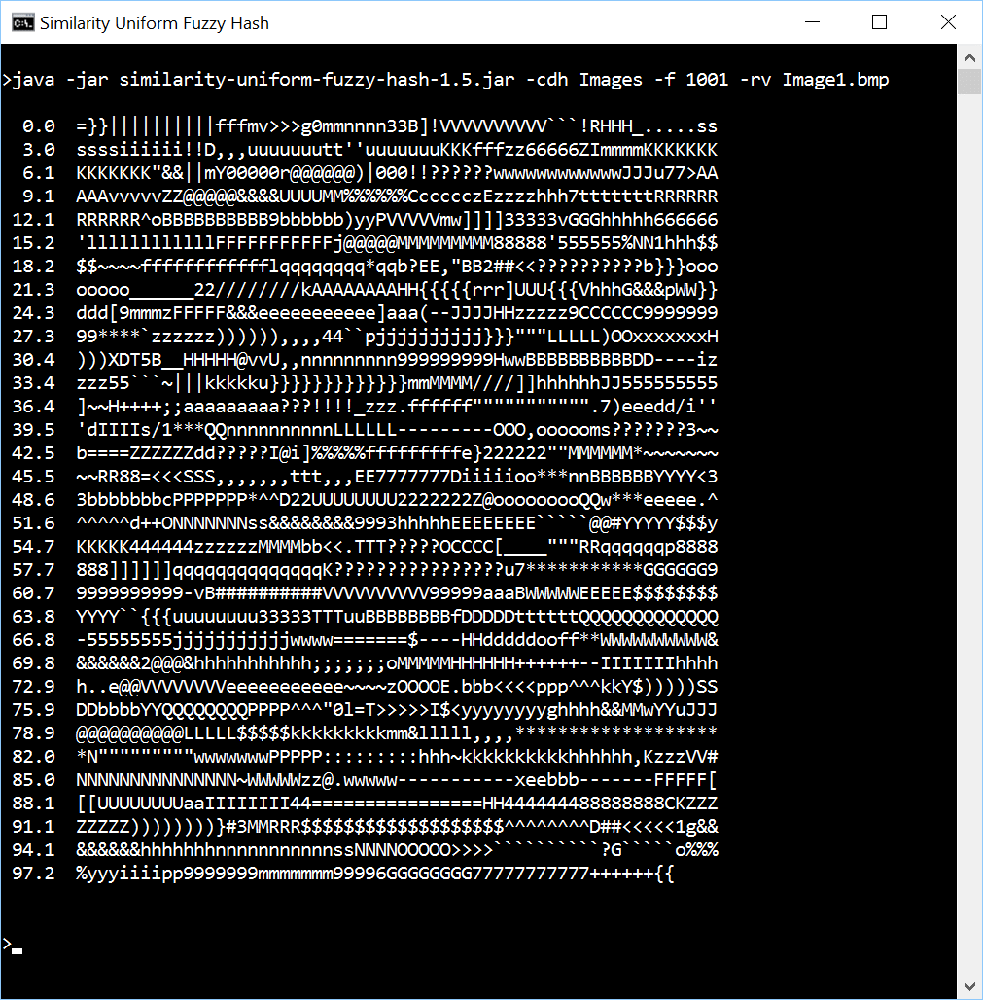</p>

  * `--compareVisually` or `-xv`

Shows a visual comparison of two hashes. Each block is represented as one or several characters, depending on the block size. The blocks which are present on both hashes are marked with a different color to the ones which are only present on one of them.

The argument `--lineWrap` or `-wrap` can be introduced, indicating the length at which lines will be wrapped. At the begining of each line, a percentage will be displayed indicating the file size scroll.

About the `--compareVisually` or `-xv` argument:

-If no argument is introduced, and two hashes were computed with the argument `--computeFileHash` or `-cfh`, they are compared visually.

<p align="center">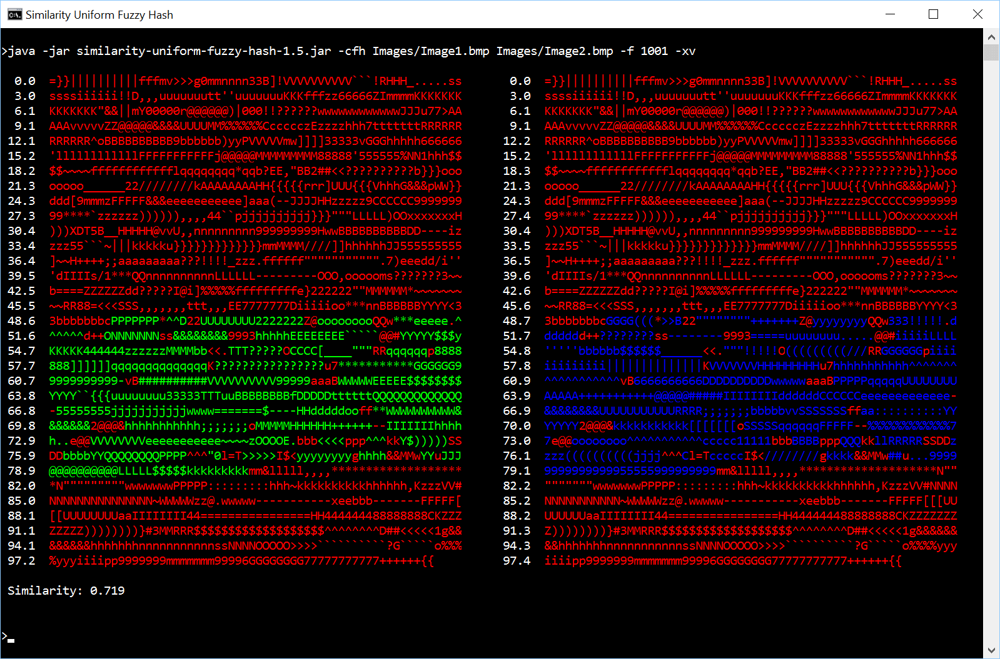</p>

-If one argument is introduced indicating a computed or loaded hash, and another hash was computed with the argument `--computeFileHash` or `-cfh`, the computed hash is compared visually to the indicated one.

<p align="center">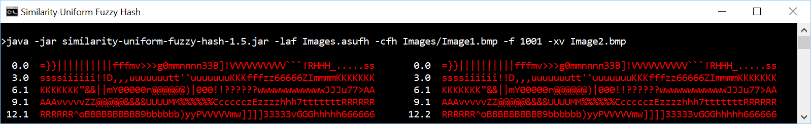</p>

-If two arguments are introduced indicating computed or loaded hashes, they are compared visually.

<p align="center">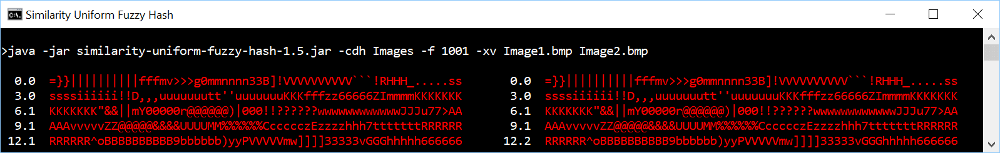</p>

# The Java Library

There are two ways to import the Java library into another Java project:

  * As an external JAR: There is no need to download or compile the project, downloading the JAR and adding it to the project as a library is enough.

  * As a Maven dependency (it is avaiblable from the Maven central repository):

  ```xml
<dependency>
      <groupId>com.github.s3curitybug</groupId>
      <artifactId>similarity-uniform-fuzzy-hash</artifactId>
      <version>LATEST</version>
</dependency>
  ```

The library provides the following classes and methods:

  * `UniformFuzzyHash`: Represents a Uniform Fuzzy Hash.

    * `[constructor]`: Given a byte[] and a factor (remember that it must be an odd number and larger than 2), builds a UniformFuzzyHash. It is polymorphed to build the hash from a String, InputStream, ByteArrayOutputStream or File instead of from a byte[].

    * `[static] checkFactor`: Checks if a factor is valid. It must be an odd number and larger than 2.

    * `toString`: Returns the hexadecimal representation of this UniformFuzzyHash.

    * `toAsciiString`: Returns the ascii representation of this UniformFuzzyHash, which is less human readable than the hexadecimal representation, but is shorter.

    * `[static] rebuildFromString`: Rebuilds a UniformFuzzyHash from its hexadecimal representation.

    * `[static] rebuildFromAsciiString`: Rebuilds a UniformFuzzyHash from its ascii representation.

    * `similarity`: Computes the similarity of this UniformFuzzyHash to another one, and returns it as a 0 to 1 double.

    * `reverseSimilarity`: Computes the similarty of another UniformFuzzyHash to this one, and returns it as a 0 to 1 double.

    * `maxSimilarity`: Returns the maximum between `similarity` and `reverseSimilarity`.

    * `minSimilarity`: Returns the minimum between `similarity` and `reverseSimilarity`.

    * `arithmeticMeanSimilarity`: Returns the arithmetic mean between `similarity` and `reverseSimilarity`.

    * `geometricMeanSimilarity`: Returns the geometric mean (square root of the product) between `similarity` and `reverseSimilarity`.

  * `UniformFuzzyHashes`: Provides utility static methods related to the Uniform Fuzzy Hash usage.

    * `computeHashesFromByteArrays`: Given a Collection of byte[] and a factor (remember that it must be an odd number and larger than 2), computes and returns a Collection of UniformFuzzyHashes. The following methods are equivalent, but receive a Collection of Strings, InputStreams, ByteArrayOutputStreams or Files instead of a Collecton of byte[]: `computeHashesFromStrings`, `computeHashesFromInputStreams`, `computeHashesFromByteArrayOutputStreams`, `computeHashesFromFiles` (allows recursive traversing of Files that represent a directory).

    * `computeNamedHashesFromNamedByteArrays`: Given a Map relating names to byte[] and a factor (remember that it must be an odd number and larger than 2), computes and returns a Map relating names to UniformFuzzyHashes. The following methods are equivalent, but receive a Map relating names to Strings, InputStreams, ByteArrayOutputStreams or Files instead of a Map relating names to byte[]: `computeNamedHashesFromNamedStrings`, `computeNamedHashesFromNamedInputStreams`, `computeNamedHashesFromNamedByteArrayOutputStreams`, `computeNamedHashesFromNamedFiles`.

    * `computeNamedHashesFromFiles`: Given a Collection of Files and a factor (remember that it must be an odd number and larger than 2), computes and returns a Map relating each File name to the File UniformFuzzyHash. Allows recursive traversing of Files that represent a directory.

    * `computeHashesFromDirectoryFiles`: Given a directory and a factor (remember that it must be an odd number and larger than 2), computes and returns a Collection of the UniformFuzzyHashes of the Files inside the directory. Allows recursive traversing of Files that represent a directory.

    * `computeNamedHashesFromDirectoryFiles`: Given a directory and a factor (remember that it must be an odd number and larger than 2), computes and returns a Map relating each the name of each File inside the directory to the File UniformFuzzyHash. Allows recursive traversing of Files that represent a directory.

    * `hashesToStrings`: Given a Collection of UniformFuzzyHashes, returns a Collection of Strings with their hexadecimal representations. The method `hashesToAsciiStrings` is equivalent, with the ascii representations instead of the hexadecimal ones.

    * `namedHashesToNamedStrings`: Given a Map relating names to UniformFuzzyHashes, returns a Map relating names to Strings with their hexadecimal representations. The method `namedHashesToNamedAsciiStrings` is equivalent, with the ascii representations instead of the hexadecimal ones.

    * `namedHashesToTextLines`: Given a Map relating names to UniformFuzzyHashes, returns a Collection of Strings with their names and hexadecimal representations. The method `namedHashesToAsciiLines` is equivalent, with the ascii representations instead of the hexadecimal ones.

    * `rebuildHashesFromStrings`: Given a Collection of Strings with the hexadecimal representations of UniformFuzzyHashes, returns the Collection of rebuilt UniformFuzzyHashes. The method `rebuildHashesFromAsciiStrings` is equivalent, with the ascii representations instead of the hexadecimal ones.

    * `rebuildNamedHashesFromNamedStrings`: Given a Map relating names to Strings with the hexadecimal representations of UniformFuzzyHashes, returns the Map relating the names to the rebuilt UniformFuzzyHashes. The method `rebuildHashesFromAsciiStrings` is equivalent, with the ascii representations instead of the hexadecimal ones.

    * `rebuildNamedHashesFromTextLines`: Given a Collection of Strings with the names and hexadecimal representations of UniformFuzzyHashes, returns the Map relating the names to the rebuilt UniformFuzzyHashes. The method `rebuildNamedHashesFromAsciiLines` is equivalent, with the ascii representations instead of the hexadecimal ones.

    * `saveToTextFile`: Saves a Map relating names to UniformFuzzyHashes into a File, in their hexadecimal representation (one name and its UniformFuzzyHash hexadecimal representation per line). The method `saveToAsciiFile` is equivalent, with the ascii representations instead of the hexadecimal ones.

    * `loadFromTextFile`: Loads a Map relating names to UniformFuzzyHashes from a File storing them in their hexadecimal representation (one name and its UniformFuzzyHash hexadecimal representation per line). The method `loadFromAsciiFile` is equivalent, with the ascii representations instead of the hexadecimal ones.

    * `sortBySimilarity`: Sorts a Collection of UniformFuzzyHashes or a Map relating names to UniformFuzzyHashes (polymorphed) by their similarity to another UniformFuzzyHash. They can be sorted by ascending or descending `similarity`, `reverseSimilarity`, `maxSimilarity`, `minSimilarity`, `arithmeticMeanSimilarity` or `geometricMeanSimilarity`.

    * `printHashes`: Prints a Collection of UniformFuzzyHashes or a Map relating names to UniformFuzzyHashes (polymorphed), using their hexadecimal representation.

    * `printHashesTable`: Given a Collection of UniformFuzzyHashes or a Map relating names to UniformFuzzyHashes (polymorphed), prints a table showing their statistics (factor, data size, number of blocks, block size mean and block size standard deviation) and hexadecimal representations.

    <p align="center">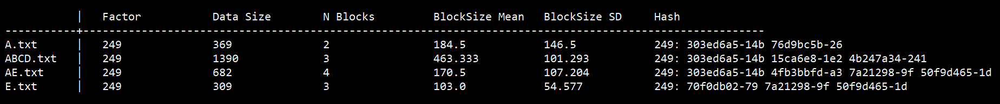</p>

    * `printHashToHashesSimilaritiesTable`: Given a UniformFuzzyHash and a Collection of UniformFuzzyHashes or a Map relating names to UniformFuzzyHashes (polymorphed), prints a table showing the `similarity`, `reverseSimilarity`, `maxSimilarity`, `minSimilarity`, `arithmeticMeanSimilarity` and `geometricMeanSimilarity` between the hash and the hashes. The table can be sorted by any of the similarities, ascending or descending. The number of rows can be limited, the hashes names can be truncated, and it is possible to mark with a color the similarities that are above or below a threshold.

    <p align="center">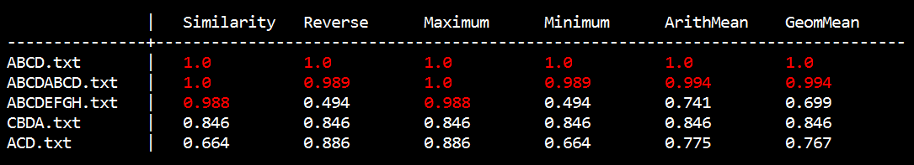</p>

    * `printAllHashesSimilaritiesTable`: Given a Collection of UniformFuzzyHashes or a Map relating names to UniformFuzzyHashes (polymorphed), prints a table showing for each hash its similarity to every other one. The hashes names can be truncated, and it is possible to mark with a color the similarities that are above or below a threshold.

    <p align="center">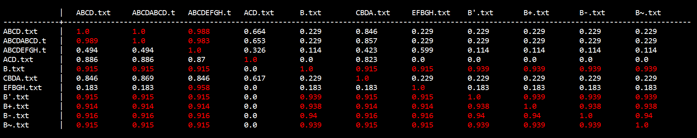</p>

  * `VisualRepresentation`: Provides utility static methods to represent and compare Uniform Fuzzy Hashes in a visual way.

    * `represent`: Returns a String representing a UniformFuzzyHash in a visual way. Each block is represented as one or several characters, depending on the block size. The characters base and the number of characters per factor size can be chosen.

    * `print`: Prints a String representing a UniformFuzzyHash in a visual way, wrapping it at a choosable length. It is possible to print at the begining of each wrapped line, a percentage indicating the wrap scroll.

    <p align="center">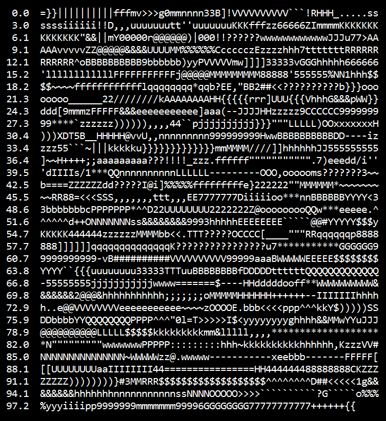</p>

    * `representCompared`: Returns a String representing a UniformFuzzyHash in a visual way like the `represent` method, but coloring the blocks which are present in another Uniform Fuzzy Hash with a different color to the ones which are not.

    * `printCompared`: Prints two Strings representing two UniformFuzzyHashes in a visual way like the `print` method, but coloring the blocks which are in both hashes with a different color to the ones which are only present on one of them.

    <p align="center">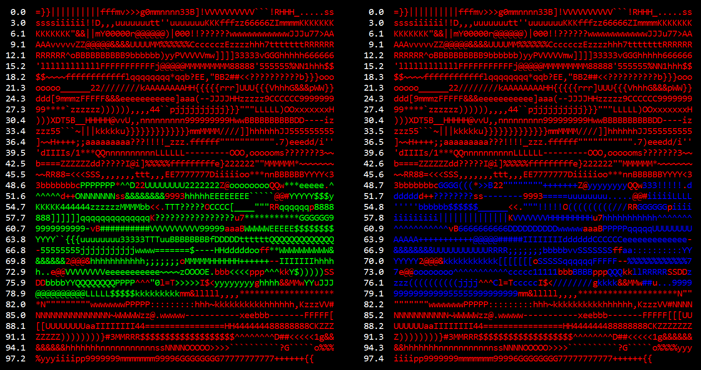</p>
